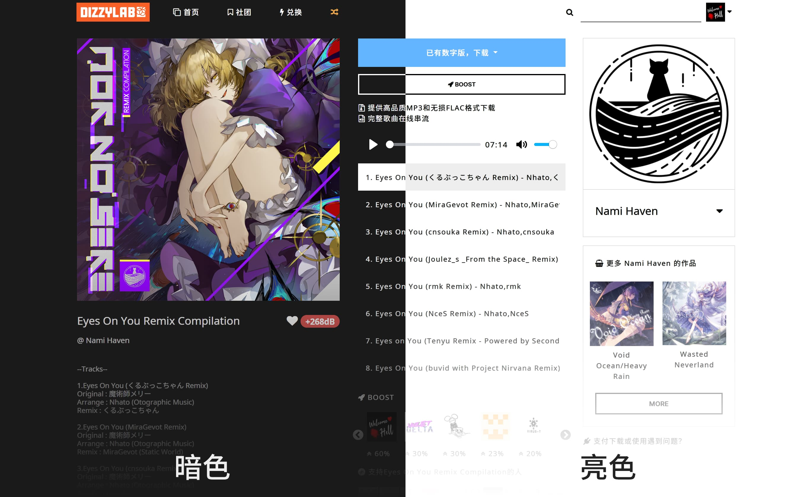

# dizzylab auto theme
[dizzylab](https://www.dizzylab.net/) 自适应主题, 跟随系统亮/暗设定.



## 安装
> 需要浏览器拥有 [Stylus](https://github.com/openstyles/stylus) 或其他同类插件.

[点击此处](https://cdn.jsdelivr.net/gh/the1812/dizzylab-auto-theme@master/dizzylab.user.css)安装.

## 编译
```powershell
sass dizzylab.scss:dizzylab.css --no-source-map
node build.js
```
